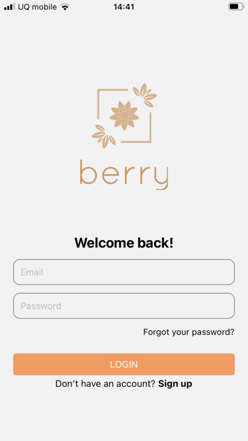
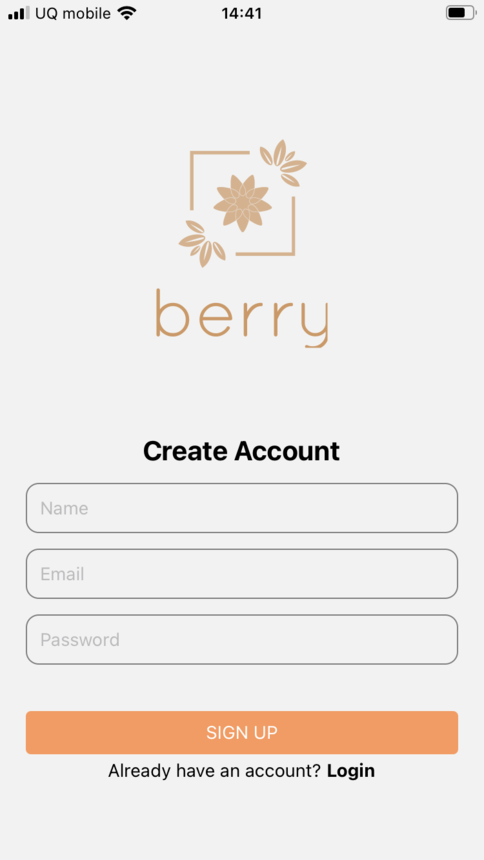
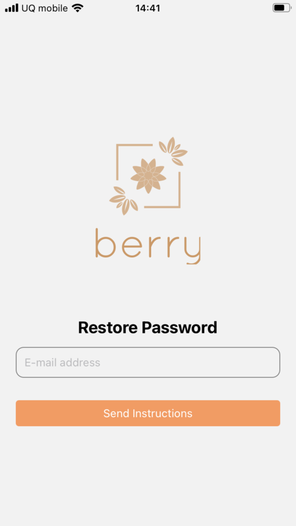
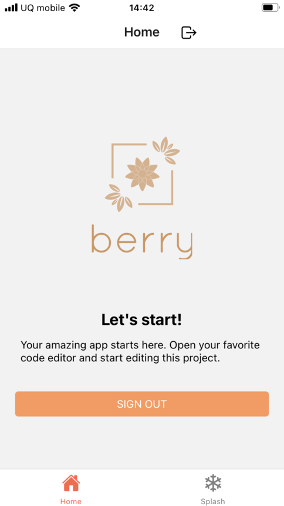

# rn-auth-template


[](https://github.com/yui0/rn-auth-template/releases)
[](LICENSE)

React Native Authentication Template

Email: eve.holt@reqres.in

Password: cityslicka

https://expo.dev/@yui.nakada/rn-auth-template?serviceType=classic&distribution=expo-go


# Features

* React Native
* React Navigation
* Async Storage with [React Native CryptoJS](https://github.com/imchintan/react-native-crypto-js)
* axios
* Support UI Kitten theme

# How to build

```
#ncu
#ncu -u
yarn
yarn web
expo publish
```

# Screenshots







# ref

* https://reqres.in/
* https://github.com/Anshul-Sonpure/API-Testing-using-Python
* https://github.com/venits/react-native-login-template
* https://colors.eva.design/
* http://wiz-code.digick.jp/ajax/ajax-login-demo.html

